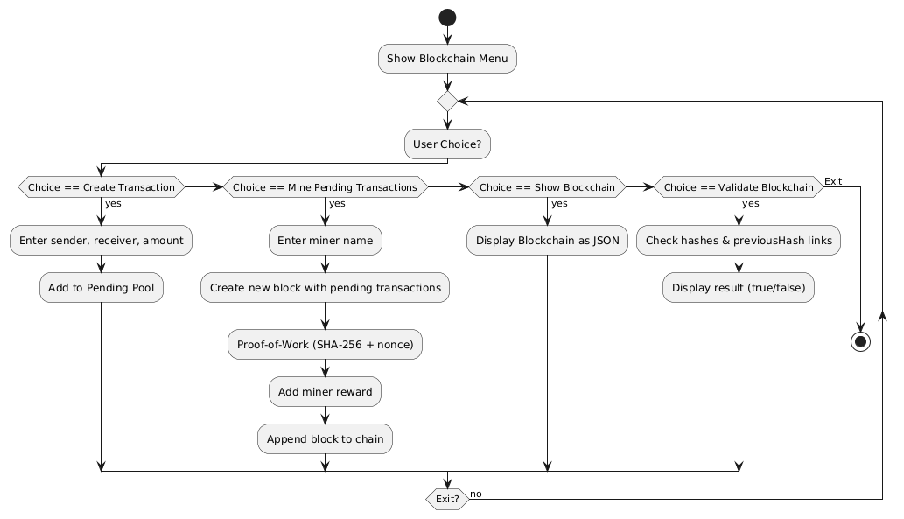

# 🪙 Blockchain Simulator (Java)

## 📌 Overview
This project is a **menu-driven blockchain simulator** built in Java.  
It demonstrates the fundamental blockchain concepts:
- Blocks and transactions
- SHA-256 hashing
- Proof-of-Work mining
- Miner rewards
- Chain validation
- JSON chain output using Gson

---

## 🚀 Features
- ✅ Create new transactions (sender, receiver, amount)
- ✅ Mine pending transactions with Proof-of-Work
- ✅ Miner receives automatic reward
- ✅ View blockchain state in **JSON format**
- ✅ Validate blockchain integrity

---

## 🛠️ Tech Stack
- **Java 17+**
- **Gson** (for JSON serialization)

---

## 📂 Project Structure
BlockchainSimulator/
├── src/
│ ├── Transaction.java
│ ├── Block.java
│ ├── Blockchain.java
│ └── BlockChainSimulator.java # Main class
├── bin/ # Compiled .class files
├── gson-2.10.1.jar # Gson library
├── MANIFEST.MF # Manifest file
├── BlockchainSimulator.jar # Runnable JAR
└── README.md


---

## ▶️ How to Build & Run

### 1. Compile to `bin/`
```bash
javac -d bin -cp "gson-2.10.1.jar;src" src/*.java
```
### 2. Run
```bash
java -cp "bin:gson-2.10.1.jar" BlockChainSimulator
```

### 3. Run jar file
```bash
java -jar BlockchainSimulator.jar
```


### SAMPLE OUTPUT
```
--- Blockchain Menu ---
1. Create Transaction
2. Mine Pending Transactions
3. Show Blockchain
4. Validate Blockchain
5. Exit
Choose: 1
Sender: User1
Receiver: User2
Amount: 10000
Transaction added to pool.

--- Blockchain Menu ---
1. Create Transaction
2. Mine Pending Transactions
3. Show Blockchain
4. Validate Blockchain
5. Exit
Choose: 2
Enter miner name: Miner1
Block mined: 00008214f724f462262a6f8ad740db9d0008da232b02e0ba3fffbf275d01b743
Block mined successfully! Reward sent to Miner1

```

### Sample Blockchain JSON Output

```
[
  {
    "hash": "f60839b17ce8df045400e5c1011f2060d4b1ab7f1decd6948ba127592cb1cda9",
    "previousHash": "0",
    "transactions": [],
    "timeStamp": 1756898933079,
    "nonce": 0
  },
  {
    "hash": "00008214f724f462262a6f8ad740db9d0008da232b02e0ba3fffbf275d01b743",
    "previousHash": "f60839b17ce8df045400e5c1011f2060d4b1ab7f1decd6948ba127592cb1cda9",
    "transactions": [
      {
        "sender": "User1",
        "receiver": "User2",
        "amount": 10000.0
      },
      {
        "sender": "System",
        "receiver": "Miner1",
        "amount": 10.0
      }
    ],
    "timeStamp": 1756898961903,
    "nonce": 44027
  }
]
```

### BLOCKCHAIN VALIDATION
```
Blockchain valid? true
```

## 📊 Flow Diagram

The following diagram shows the working of our blockchain simulator:



## 👨‍💻 Author

- **DEEP SAHA**  
- Email: dip23447@gmail.com  
- GitHub: [Deep-Saha1925](https://github.com/Deep-Saha1925)
